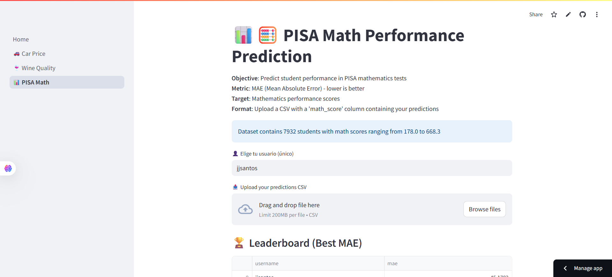

# Mini-hackathons

A multi-page Streamlit application for hosting machine learning challenges with automatic scoring and leaderboards. Perfect for educational environments, competitions, or skill assessment.


## Features

- **Multiple Challenge Types**: Supports regression and classification tasks
- **Automatic Scoring**: Real-time evaluation with various metrics (RMSE, MAE, Accuracy)
- **Leaderboards**: Track best scores per user across all challenges
- **Multi-page Navigation**: Clean URL-based navigation between challenges
- **Persistent Storage**: SQLite database for score persistence
- **User Management**: Username handling with URL parameter support

## Available Challenges

### 🚗 Car Price Prediction

- **Type**: Regression
- **Metric**: RMSE (Root Mean Square Error)
- **Goal**: Predict automobile prices
- See instruction at [hackaton_regression_students.ipynb](/hackaton_regression_students.ipynb)

    

### 🍷 Wine Quality Classification

- **Type**: Multiclass Classification  
- **Metric**: Accuracy
- **Goal**: Classify wine quality scores (3-9 scale)

    

### 📊 PISA Math Performance

- **Type**: Regression
- **Metric**: MAE (Mean Absolute Error)
- **Goal**: Predict student performance in PISA mathematics tests

    

## Project Structure

```
├── Home.py                      # Main landing page
├── config.py                    # Database configuration
├── utils.py                     # Shared utility functions
├── requirements.txt             # Python dependencies
├── pages/
│   ├── 1_🚗_Car_Price.py       # Car price prediction challenge
│   ├── 2_🍷_Wine_Quality.py    # Wine quality classification
│   └── 3_📊_PISA_Math.py       # PISA math performance prediction
├── leaderboard.db               # SQLite database (auto-generated)
└── README.md
```

## Local Setup

### Prerequisites

- Python 3.8+
- pip

### Installation

1. **Clone the repository**

```bash
git clone https://github.com/jjsantos01/automobile-mini-hackathon.git
cd automobile-mini-hackathon
```

2. **Create virtual environment** (recommended)

```bash
python -m venv venv
source venv/bin/activate  # On Windows: venv\Scripts\activate
```

3. **Install dependencies**

```bash
pip install -r requirements.txt
```

4. **Set up test data URLs**

Create a `.streamlit/secrets.toml` file in the project root:

```toml
URL_CAR_TEST_Y = "https://your-domain.com/car_test_y.csv"
URL_WINE_TEST_Y = "https://your-domain.com/wine_test_y.csv"
URL_PISA_TEST_Y = "https://your-domain.com/pisa_math_test_y.csv"
```

5. **Run the application**

```bash
streamlit run Home.py
```

The app will be available at `http://localhost:8501`

## Test Data Format

Each challenge expects a CSV file with specific column names:

- **Car Price**: `price` column with numeric values
- **Wine Quality**: `quality` column with integer values (3-9)
- **PISA Math**: `math_score` column with numeric values

Example test file structure:

```csv
price
15000.50
22000.00
18500.75
```

## Adding New Challenges

1. **Create new page file** in `pages/` directory:

```python
# pages/4_🎯_New_Challenge.py
import streamlit as st
# ... implement challenge logic
```

2. **Add database table** in `config.py`:

```python
conn.execute("""
CREATE TABLE IF NOT EXISTS new_challenge_scores (
    username TEXT PRIMARY KEY,
    score_metric REAL,
    uploaded_at DATETIME DEFAULT CURRENT_TIMESTAMP
)
""")
```

3. **Add secret URL** for test data in `.streamlit/secrets.toml`

4. **Update main page** description in `Home.py`

## Deployment

### Streamlit Cloud

1. Push code to GitHub
2. Connect repository to [Streamlit Cloud](https://streamlit.io/cloud)
3. Add secrets in the Streamlit Cloud dashboard
4. Deploy

### Other Platforms

The app can be deployed on any platform supporting Python web applications (Heroku, Railway, etc.). Ensure environment variables for test data URLs are properly configured.

## Usage for Students

1. **Access the platform** via the provided URL
2. **Choose a challenge** from the sidebar navigation
3. **Enter username** (will be saved in URL for convenience)
4. **Download training data** and develop ML model
5. **Upload predictions** as CSV with the required column name
6. **View score** and compete on the leaderboard

## Database Schema

The application uses SQLite with separate tables for each challenge:

```sql
-- Car price predictions
CREATE TABLE car_scores (
    username TEXT PRIMARY KEY,
    rmse REAL,
    uploaded_at DATETIME DEFAULT CURRENT_TIMESTAMP
);

-- Wine quality classifications
CREATE TABLE wine_scores (
    username TEXT PRIMARY KEY,
    accuracy REAL,
    uploaded_at DATETIME DEFAULT CURRENT_TIMESTAMP
);

-- PISA math performance predictions
CREATE TABLE pisa_scores (
    username TEXT PRIMARY KEY,
    mae REAL,
    uploaded_at DATETIME DEFAULT CURRENT_TIMESTAMP
);
```
